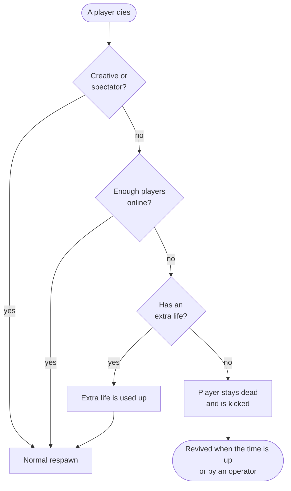

<div align="center">


# Timed Hardcore

**Hardcore multiplayer where death is temporary.**
Die, and you stay dead for a set time instead of forever.

[](https://www.minecraft.net/)
[](https://fabricmc.net/)
[](https://adoptium.net/)
[](LICENSE)

[](https://github.com/Laubfrosch49/minecraft-timed-hardcore/actions/workflows/build.yml)
[](https://github.com/Laubfrosch49/minecraft-timed-hardcore/releases/latest)

[Features](#features) · [Installation](#installation) · [Commands](#commands) · [Configuration](#configuration) · [FAQ](#faq)

</div>

---

Timed Hardcore turns hardcore multiplayer into something you can actually play with friends. Death still hurts: you are kicked and cannot join until you are revived. But you come back, either after a set duration or at fixed times of the day.

> [!NOTE]
> The mod runs on the **server**. Installing it on the **client is optional**: players without it can join and play normally, they just miss a few visual extras.

## Features

- **Timed death**: die, and you stay dead for a configurable time. Rejoining shows how long is left.
- **Two revival modes**: after a duration (for example 24 hours) or at fixed times of the day (for example midnight and noon).
- **Safe rule**: with enough players online, a death has no consequences. Dying only counts when you play alone.
- **Extra life**: a green apple saves you once. It is only sold by the rare Wandering Healer.
- **Graveyard**: an advancement tab that shows the rules of the server and everyone who is currently dead.
- **Always know where you stand**: a risk icon next to every name in the player list, and a notice with sound whenever your own risk changes.
- **Keep your inventory**: players who stay dead keep their items and XP, controlled by a game rule.
- **Easy to run**: every setting can be changed with a command or in a JSON file, without a restart.

## How it works

Every player is in one of three states at any moment. The state decides what happens if they die right now:

| State         | When                                 | What a death means                              | Hearts (with client mod) |
|---------------|--------------------------------------|-------------------------------------------------|--------------------------|
| **At risk**   | You are alone and have no extra life | You stay dead until you are revived             | Red hardcore hearts      |
| **Protected** | You have an extra life               | The extra life is used up, you respawn normally | Green hearts             |
| **Safe**      | Enough players are online            | Nothing, you respawn normally                   | Normal hearts            |

Players in creative or spectator mode are never affected.



### What a dead player sees

- **On death**: a kick screen with the cause of death, how long they stay dead and when they are revived.
- **When they try to join**: `YOU ARE STILL DEAD`, with the time left.
- **In the server list** (client mod): the second MOTD line reads `You are dead for another 3 h 12 min.`, and after the revival `You have been revived · join again!`

Everyone else gets a chat message when a player dies and when they are alive again.

### Extra lives and the Wandering Healer

Eating a **green apple** grants one extra life. It has no other effect, can be eaten on a full stomach, and you can only hold one extra life at a time.

The apple is sold by the **Wandering Healer**, a rare variant of the wandering trader. Each healer offers six random healing and survival items with varying prices, and exactly one green apple at the bottom of the list. Expect it to be expensive.

### Graveyard

The advancement screen gets a new tab, **Graveyard**. It always shows the current rules (revival, safe rule, extra life, inventory) and lists every dead player with their head, cause of death and time of revival. It works without the client mod.

## Installation

**Requirements:** Minecraft 26.3 · Fabric Loader 0.19.5 or newer · [Fabric API](https://modrinth.com/mod/fabric-api) · Java 25

### Server

1. Set up a [Fabric server](https://fabricmc.net/use/server/) for Minecraft 26.3.
2. Put the Timed Hardcore JAR and Fabric API into the `mods` folder.
3. Recommended: create the world with `hardcore=true` in `server.properties`, so players without the client mod see hardcore hearts.

> [!IMPORTANT]
> `hardcore=true` only applies when the world is **created**. Changing it later has no effect on an existing world. The mod works either way and prints a hint in the console if the world is not in hardcore mode.

### Client (optional)

Put the same JAR and Fabric API into the `mods` folder of your client. That adds:

|                  | Without the client mod                 | With the client mod                                              |
|------------------|----------------------------------------|------------------------------------------------------------------|
| Hearts           | Follow the world's hardcore setting    | Change live with your risk: red, green or normal                 |
| Death screen     | Follows the world's hardcore setting   | The normal respawn button whenever the death has no consequences |
| Green apple      | A glinting red apple with a green name | Its own green texture, also in the totem animation               |
| Wandering Healer | Looks like a normal wandering trader   | Its own robe with a green cross                                  |
| Server list      | Normal MOTD                            | Shows how long you are still dead, or that you were revived      |

> [!TIP]
> In singleplayer the mod does nothing, so you can leave it installed for your own worlds.

## Commands

### For everyone

| Command               | What it does                                                 |
|-----------------------|--------------------------------------------------------------|
| `/timedhardcore info` | Shows the rules of the server at a glance, and your own risk |
| `/timedhardcore dead` | Lists who is dead and for how long                           |

### For operators

| Command                                   | What it does                                                                                            |
|-------------------------------------------|---------------------------------------------------------------------------------------------------------|
| `/revive <player>`                        | Revives a dead player at once                                                                           |
| `/timedhardcore list`                     | Risk of all online players, the dead players (with a clickable revive button) and who has an extra life |
| `/timedhardcore duration [minutes]`       | Shows or sets how long players stay dead, and switches to the duration mode                             |
| `/timedhardcore times [times]`            | Shows or sets the fixed revival times, for example `0:00 12:00`, and switches to that mode              |
| `/timedhardcore mode [duration\|times]`   | Shows or switches the revival mode                                                                      |
| `/timedhardcore safe [count]`             | Shows or sets the safe rule. `0` switches it off                                                        |
| `/timedhardcore life give\|take <player>` | Grants or removes an extra life                                                                         |
| `/timedhardcore apple [players]`          | Gives a green apple                                                                                     |
| `/timedhardcore healer`                   | Spawns a Wandering Healer at your position                                                              |
| `/timedhardcore reload`                   | Reads the config and the data files again                                                               |

> [!NOTE]
> When the revival settings change, all dead players are recalculated from their time of death. Someone who is already due after the change is revived right away.

## Configuration

The settings live in `config/timed-hardcore.json`. The file is created on the first start. You can edit it while the server is running and apply it with `/timedhardcore reload`.

```json
{
  "reviveMode": "DURATION",
  "deathDuration": 1440.0,
  "reviveTimes": ["00:00", "12:00"],
  "safePlayerCount": 0,
  "extraLivesEnabled": true,
  "healerSpawnChance": 0.2,
  "showRemainingTimeInMotd": true
}
```

| Option                    | Default          | Meaning                                                                                             |
|---------------------------|------------------|-----------------------------------------------------------------------------------------------------|
| `reviveMode`              | `DURATION`       | `DURATION`: revived after `deathDuration`. `FIXED_TIMES`: revived at the next time in `reviveTimes` |
| `deathDuration`           | `1440.0`         | Minutes a player stays dead. Decimals are allowed. `0` means deaths have no consequences            |
| `reviveTimes`             | `00:00`, `12:00` | Times of day at which all dead players are revived, in the time zone of the server                  |
| `safePlayerCount`         | `0`              | With at least this many players online, a death has no consequences. `0` switches the rule off      |
| `extraLivesEnabled`       | `true`           | Enables the green apple and extra lives                                                             |
| `healerSpawnChance`       | `0.2`            | Share of naturally spawned wandering traders that are healers, from `0` to `1`                      |
| `showRemainingTimeInMotd` | `true`           | Lets the client mod show the remaining time in the server list                                      |

### Game rule

| Game rule                                      | Default | Meaning                                                                                                                |
|------------------------------------------------|---------|------------------------------------------------------------------------------------------------------------------------|
| `timed-hardcore:keep_inventory_on_timed_death` | `true`  | Players who stay dead keep their inventory and XP. If `false`, the normal `keepInventory` rule applies to them as well |

```
/gamerule timed-hardcore:keep_inventory_on_timed_death false
```

Deaths without consequences always follow the normal `keepInventory` rule.

### Data files

| File                                | Content                                |
|-------------------------------------|----------------------------------------|
| `<world>/timed-hardcore.json`       | Who is dead, since when and until when |
| `<world>/timed-hardcore-lives.json` | Who has an extra life                  |

Both files can be edited by hand and applied with `/timedhardcore reload`. If a file is invalid, the reload reports the error and the current data stays active. A file that is already broken at server start is moved aside as `.broken` instead of being overwritten.

## FAQ

<details>
<summary><b>Can players without the mod join?</b></summary>

Yes. Everything that matters happens on the server. The mod adds no new items or blocks: the green apple is a normal apple with extra data, and the healer is a normal wandering trader.
</details>

<details>
<summary><b>Does the dead time keep running while the server is offline?</b></summary>

Yes. The revival is a fixed point in real time, not a countdown.
</details>

<details>
<summary><b>Which time zone do the fixed revival times use?</b></summary>

The time zone of the server. Many hosts run on UTC, so `00:00` may not be midnight for your players.
</details>

<details>
<summary><b>What does the server list reveal?</b></summary>

So that the client mod can find its own player, the server attaches the UUID and remaining time of every dead player to its server list response. Anyone who pings the server can read that. No names and no IP addresses are sent or stored. Set `showRemainingTimeInMotd` to `false` to switch it off.
</details>

<details>
<summary><b>Can I still ban players the normal way?</b></summary>

Yes. Timed deaths are stored separately and have nothing to do with the ban list.
</details>

## Building from source

```bash
git clone https://github.com/Laubfrosch49/minecraft-timed-hardcore.git
cd minecraft-timed-hardcore
./gradlew build
```

The JAR ends up in `build/libs`. The build needs Java 25 and runs the automated server tests. To run only those:

```bash
./gradlew runGameTest
```

## License

Released under [CC0 1.0](LICENSE): do whatever you like with it.

<div align="center">
<sub>Not an official Minecraft product. Not approved by or associated with Mojang or Microsoft.</sub>
</div>
